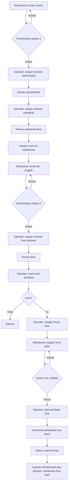

# Alur Bisnis (sumber: flowchart swimlane pengguna)

Pengaturan pendukung: Pimpinan Operator (CRUD akun, hak akses) · Operator (Ruang Kontrol: jadwal, kuota/batas dana; CRUD dan konfirmasi form penilaian) · Registrasi/login mahasiswa · Pembimbing memantau status.

## Celah pada alur (perlu diputuskan)
1. **Review administratif tidak punya cabang gagal.** Alur langsung ke substantif. Perlu hasil: lolos / perlu perbaikan / gugur (DEC-12).
2. **Tidak ada tenggat dan batas ronde.** Loop tolak → revisi → tolak dapat tanpa akhir; mahasiswa atau reviewer yang tidak merespons menahan proposal (DEC-18).
3. **Form dapat berubah saat review berjalan.** Diatasi dengan konfirmasi/kunci dan versi (REQ-06).
4. **Skor mana yang dipakai** setelah dua penilaian substantif tidak disebut (DEC-06).
5. **"Kuota" dan "set 10 proposal" ambigu** (DEC-13, DEC-14).
6. **Tidak ada notifikasi** pada alur; ditambahkan di setiap perubahan status.
7. **Operator memegang hampir semua keputusan.** Audit log wajib, dan keputusan final tercatat per batch dengan peserta.
8. **Klaim akun:** jika kredensial dikirim ke alamat yang diketik pengklaim, akun bisa direbut (Architecture §6).

## Status celah (v0.3)
- Celah 1 (admin tanpa cabang gagal): **selesai** — review administratif tidak dinilai; kekurangan diberikan ke mahasiswa (DEC-12).
- Celah 4 (skor mana): **selesai** — skor review final (DEC-06).
- Celah 5 (kuota, 10 proposal): **selesai** — kuota klaster PT per bidang; dosen maks 10 proposal (DEC-13, DEC-14).
- Celah 8 (klaim akun): **ditangani** — Architecture §6.
- Masih terbuka: tenggat dan batas ronde (DEC-18).
